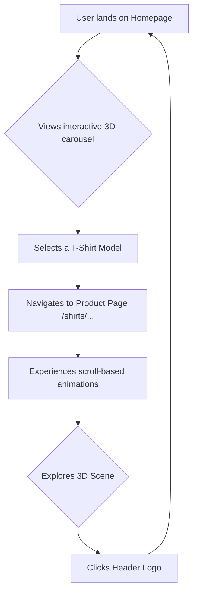

# 3D Animated T-Shirt Showcase

This is an advanced, cinematic 3D website designed to showcase t-shirt products in an immersive and interactive way. The project leverages cutting-edge web technologies like Next.js, React Three Fiber, and GSAP to create a fluid, animation-driven user experience.

## Live Demo

Experience the live version of the site here: [http://3d-tshirt-one.vercel.app/](http://3d-tshirt-one.vercel.app/)

## Key Features

- **Interactive 3D Homepage**: The landing page features a main 3D scene where users can cycle through and select different product experiences.
- **Cinematic Product Pages**: Each product has a dedicated, scroll-driven animated scene that tells a story and showcases the t-shirt in a unique environment.
- **Dynamic Theming**: The UI, including the header and footer, dynamically adapts its color scheme based on the product being viewed for a cohesive feel.
- **High-Fidelity 3D Models**: Utilizes optimized `.glb` models with baked textures for realistic and performant 3D rendering.
- **Complex Animations**: Powered by GSAP and React Three Fiber, the site features complex, cinematic transitions and scroll-based animations that guide the user experience.
- **Audio Integration**: Includes a subtle music streamline component to enhance the immersive atmosphere.
- **Responsive Design**: The experience is optimized for both desktop and mobile devices, ensuring a smooth experience across different screen sizes.

## Tech Stack

- **Framework**: [Next.js](https://nextjs.org/) (v16 App Router)
- **UI Library**: [React](https://react.dev/) (v19)
- **3D Rendering**: [React Three Fiber](https://docs.pmnd.rs/react-three-fiber/getting-started/introduction) & [Drei](https://github.com/pmndrs/drei)
- **Animation**: [GSAP (GreenSock Animation Platform)](https://gsap.com/)
- **Styling**: [Tailwind CSS](https://tailwindcss.com/)
- **Language**: [TypeScript](https://www.typescriptlang.org/)

## Application Flow

The user journey is designed to be simple and intuitive, flowing from discovery to exploration.



## Color & Theming

The application uses a dynamic color system that themes the entire page based on the selected product.

| Product Slug | Text Color | Scene Background |
| :----------- | :--------- | :--------------- |
| `sport`      | `red`      | `#2b0000`        |
| `white`      | `black`    | `white`          |
| `gray`       | `white`    | `#252525`        |

## Project Structure

The codebase is organized into several key directories:

- **`/app`**: Contains the core routing for the Next.js application, including the main homepage and the dynamic `[slug]` pages for each shirt.
- **`/components`**: Holds all the React components, from UI elements like `Header` and `Footer` to the complex 3D scenes and models.
- **`/lib`**: Includes helper functions, custom hooks, and configuration files for things like color palettes and animations.
- **`/public`**: Stores all static assets, such as 3D models (`.glb`), textures, icons, and fonts.

## Getting Started

To run this project locally, follow these steps:

1.  **Clone the repository:**
    ```bash
    git clone <your-repository-url>
    cd 3d-website
    ```

2.  **Install dependencies:**
    ```bash
    npm install
    ```

3.  **Run the development server:**
    ```bash
    npm run dev
    ```

Open [http://localhost:3000](http://localhost:3000) in your browser to see the result.
