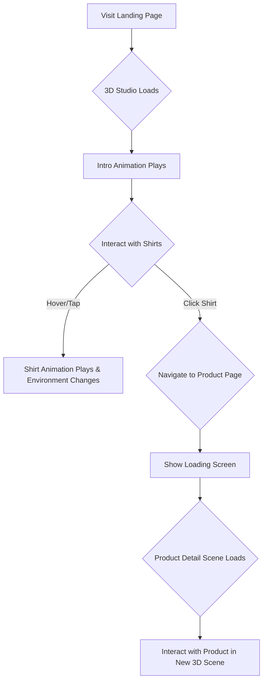

# 3D T-Shirt Configurator

An interactive, animated 3D product viewing experience built with Next.js, Three.js, and GSAP. This project showcases different t-shirt models in a dynamic 3D studio environment.

**Live Demo:** [http://3d-tshirt-one.vercel.app/](http://3d-tshirt-one.vercel.app/)

---


## About The Project

This project is a modern e-commerce or portfolio proof-of-concept that allows users to explore a collection of t-shirts in a seamless 3D environment. It leverages a sophisticated tech stack to deliver smooth animations, realistic 3D models, and a responsive, mobile-first design. The experience begins with an overview of three distinct shirt styles, which the user can navigate between. Selecting a shirt transitions the user to a dedicated detail page with further interactive scenes.

## Features

- **Interactive 3D Studio:** A main scene showcasing three different t-shirt models.
- **GSAP Animations:** Complex and smooth animations for scene transitions, camera movements, and UI interactions.
- **Dynamic Routing:** Seamless navigation between the main studio and individual product pages using Next.js App Router.
- **Responsive Design:** A fully responsive interface that adapts to desktop and mobile devices, with distinct interaction models for each.
- **Advanced 3D Graphics:** Utilizes `@react-three/fiber` and `@react-three/drei` for efficient and powerful 3D rendering in React.
- **Texture & Material Management:** Pre-loads textures and dynamically swaps materials to create interactive hover and selection effects.
- **Loading Management:** Provides visual feedback during model loading and page navigation.

## Technology Stack

This project is built with a modern, high-performance tech stack:

- **Framework:** [Next.js](https://nextjs.org/) (v16+)
- **UI Library:** [React](https://react.dev/) (v19+)
- **3D Rendering:** [Three.js](https://threejs.org/) via [@react-three/fiber](https://github.com/pmndrs/react-three-fiber) & [@react-three/drei](https://github.com/pmndrs/drei)
- **Animation:** [GSAP (GreenSock Animation Platform)](https://gsap.com/) & [@gsap/react](https://gsap.com/docs/v3/React/)
- **Styling:** [Tailwind CSS](https://tailwindcss.com/)
- **Language:** [TypeScript](https://www.typescriptlang.org/)
- **Linting:** [ESLint](https://eslint.org/)

## Project Structure

The codebase is organized into several key directories:

```
/
├── app/                  # Next.js App Router: contains all pages and layouts.
│   ├── shirts/[slug]/    # Dynamic route for individual shirt detail pages.
│   ├── layout.tsx        # Root layout, sets up the main 3D canvas.
│   └── page.tsx          # The main landing page component.
│
├── components/           # All React components used throughout the application.
│   ├── MainStudioModel.tsx # The core 3D component for the landing page.
│   ├── ViewCanvas.tsx    # Hosts the main <Canvas> for the 3D experience.
│   └── ...               # Other UI and 3D components.
│
├── lib/                  # Utility functions, custom hooks, and constants.
│   ├── useTextures.tsx   # Custom hook for loading 3D textures.
│   ├── material.tsx      # Functions for creating and managing materials.
│   └── ...               # Other helper modules.
│
├── public/               # Static assets.
│   ├── models/           # GLB files for the 3D models.
│   └── textures/         # Image and video textures for the models.
│
└── ...                   # Configuration files (package.json, next.config.ts, etc.)
```

## Getting Started

To get a local copy up and running, follow these simple steps.

### Prerequisites

- Node.js (v18 or later)
- npm or yarn

### Installation

1.  Clone the repo
    ```sh
    git clone https://github.com/your-username/3d-website.git
    ```
2.  Install NPM packages
    ```sh
    npm install
    ```
3.  Run the development server
    ```sh
    npm run dev
    ```
4.  Open [http://localhost:3000](http://localhost:3000) with your browser to see the result.

## Application Flow & Architecture

The application uses a clean, component-based architecture that separates concerns effectively. The user journey is designed to be fluid and intuitive.

### User Flow

The primary user flow involves exploring shirts in the main studio and then diving into a detailed view.



### Component Architecture

The 3D rendering is managed by a central `ViewCanvas` component that lives in the root layout. This allows for a persistent and performant 3D context across different pages.

-   **`app/layout.tsx`**: Renders `<ViewCanvas />` which contains the main `<Canvas>` from `@react-three/fiber`.
-   **`components/ViewCanvas.tsx`**: Sets up the Three.js canvas and shared environment settings.
-   **`app/page.tsx`**: Contains a `<View>` component from `@react-three/drei`. This `<View>` acts as a "portal" to render its children inside the main `<ViewCanvas />`.
-   **`components/MainStudioModel.tsx`**: Contains the actual `THREE.Mesh` objects, loads the GLB models, and defines the animation logic. This is rendered inside the `<View>` on the main page.

This architecture is highly efficient, as the WebGL context is never destroyed during page navigation, allowing for smooth transitions.

```mermaid
graph TD
    subgraph Root Layout
        A[ViewCanvas]
    end

    subgraph Landing Page (`/`)
        B[View] --> C[MainStudioModel]
    end
    
    subgraph Product Page (`/shirts/[slug]`)
        D[View] --> E[ShirtDetailModel]
    end

    A -- Renders --> B
    A -- Renders --> D
    C -- Contains --> F[3D Meshes & Animation Logic]
    E -- Contains --> G[Detailed 3D Meshes & Animations]

    style A fill:#222,stroke:#333,stroke-width:2px,color:#fff
    style B fill:#333,stroke:#555,stroke-width:2px,color:#fff
    style D fill:#333,stroke:#555,stroke-width:2px,color:#fff
```

## Animation System

Animations are a core part of the experience, powered by **GSAP**.

-   **Intro Animation**: On the initial load of the main studio, a cinematic animation is triggered using `useGSAP` to move the camera and models into place. This is tracked via `sessionStorage` to ensure it only runs once per session.
-   **Interactive Animations**:
    -   **Desktop**: Hovering over a shirt triggers a `gsap.timeline` that scales the model and rotates it to face the camera. The environment's texture also changes dynamically.
    -   **Mobile**: Tapping arrows allows the user to cycle through the shirts, triggering GSAP animations that shift the positions of the models.
-   **Navigation Transitions**: When navigating to a product page, a loading screen is displayed while GSAP handles the animation of the new scene.

---
This README provides a comprehensive overview of the project, its technologies, and its architecture, designed to be a helpful resource for any developer looking to understand or contribute to the codebase.
